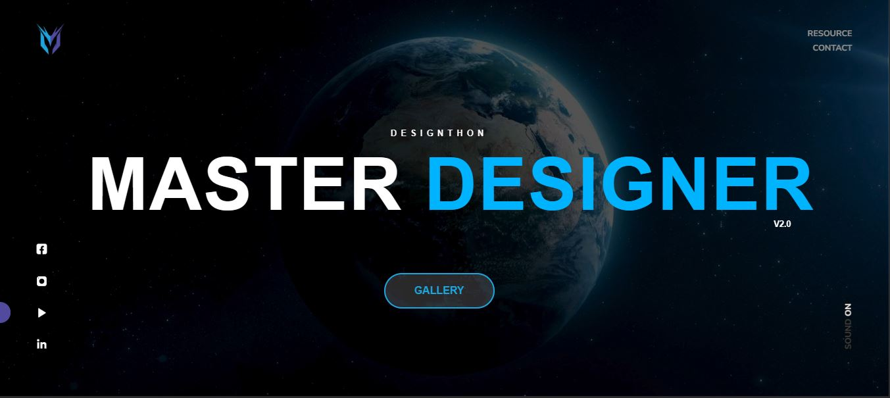

# Master Designer v2.0



Master Designer v2.0 is the official website for the All-Island Design Competition, Sri Lanka's premier creative design event that brings together talented designers, artists, and innovators from across the country. The website showcases competition details, participant galleries, sponsor information, event timelines, winner announcements, and provides an interactive platform for registration and community engagement. Built with modern web technologies, it features responsive design, interactive 3D elements, smooth animations, and optimized performance to deliver an exceptional user experience.

## Table of Contents

- [Features](#features)
- [Technologies Used](#technologies-used)
- [Project Structure](#project-structure)
- [Installation](#installation)
- [Usage](#usage)
- [Development](#development)
- [Build](#build)
- [Contributing](#contributing)
- [License](#license)
- [Developers](#developers)

## Features

- **Competition Overview**: Detailed information about the All-Island Design Competition
- **Responsive Design**: Optimized for all devices including mobile, tablet, and desktop
- **Interactive Gallery**: Showcase of participant designs and creative works
- **Event Timeline**: Comprehensive schedule of competition phases and deadlines
- **Winner Announcements**: Dedicated section for competition results and achievements
- **Sponsor Showcase**: Recognition of event sponsors and partners
- **Registration Portal**: Easy-to-use registration system for participants
- **FAQ Section**: Comprehensive answers to common questions
- **3D Interactive Elements**: Engaging 3D models and animations using WebGL
- **Modern UI/UX**: Smooth animations, custom styling, and intuitive navigation
- **Performance Optimized**: Efficient asset loading and fast page rendering
- **Multi-language Support**: Accessible content for diverse participants

## Technologies Used

- **HTML5**: Semantic markup and structure
- **CSS3**: Advanced styling with animations and responsive design
- **JavaScript**: Interactive functionality and DOM manipulation
- **jQuery**: Simplified JavaScript operations
- **WebGL**: 3D model rendering via Three.js or similar
- **Custom CSS Animations**: Enhanced user experience
- **Vercel**: Deployment and hosting

## Project Structure

```
master-designer-v2.0/
├── src/                     # Source files
│   ├── js/                 # JavaScript files
│   │   ├── components/     # Reusable components
│   │   └── pages/         # Page-specific scripts
│   ├── css/               # CSS files
│   │   ├── components/    # Component-specific styles
│   │   ├── layouts/       # Layout styles
│   │   └── pages/        # Page-specific styles
│   └── pages/            # HTML pages
├── public/                 # Static assets
│   ├── assets/
│   │   ├── images/        # Image files
│   │   ├── videos/        # Video files
│   │   ├── fonts/         # Custom fonts
│   │   ├── icons/         # Icon files
│   │   ├── audio/         # Audio files
│   │   ├── models/        # 3D models (GLTF files)
│   │   └── draco/         # Draco compression files
│   └── favicon/           # Favicon files
├── profile/                # Profile images
├── cdn-cgi/               # Cloudflare scripts
├── faq.html               # FAQ page
├── gallery.html           # Gallery page
├── index.html             # Main entry point
├── vercel.json            # Vercel deployment config
└── README.md              # Project documentation
```

## Installation

1. Clone the repository:
   ```bash
   git clone https://github.com/your-username/master-designer-v2.0.git
   cd master-designer-v2.0
   ```

2. No additional dependencies required as this is a static site.

## Usage

1. Open `index.html` in your preferred web browser.
2. For development with live reloading, use a local server:
   - Python: `python -m http.server 8000`
   - Node.js: `npx serve .`
   - Or use any static file server.

3. Navigate through the different sections: Home, Gallery, FAQ, etc.

## Development

The project follows a modular structure:
- Source files are organized in the `src` directory
- Static assets are served from the `public` directory
- HTML pages are in `src/pages/`
- Styles are componentized in `src/css/`
- JavaScript is modularized in `src/js/`

### Development Server

For local development, serve the files from the root directory using any static server.

## Build

This is a static site with no build process. Files are ready for deployment as-is. For production, the `public` assets are optimized and served directly.

## Contributing

1. Fork the repository
2. Create a feature branch (`git checkout -b feature/amazing-feature`)
3. Commit your changes (`git commit -m 'Add some amazing feature'`)
4. Push to the branch (`git push origin feature/amazing-feature`)
5. Open a Pull Request

## License

This project is licensed under the MIT License - see the [LICENSE](LICENSE) file for details.

## Developers

- **Dhanuka Rathnayaka** - Developer ([LinkedIn](https://www.linkedin.com/in/dhanuka-rathnayaka))
- **Gayanga Bandara** - Developer ([LinkedIn](https://www.linkedin.com/in/gayanga-bandara))